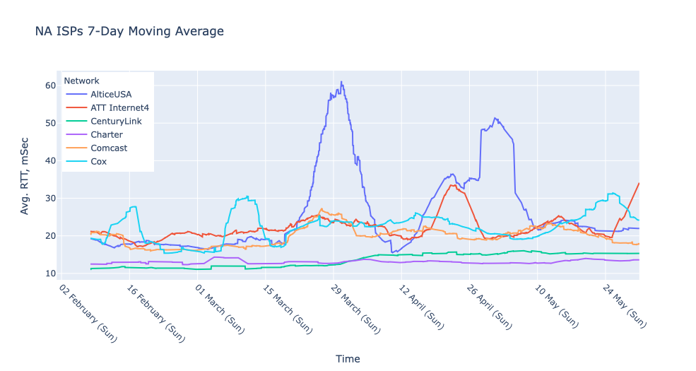

# NetworkDashboard
This is set of Python scripts and Jupyter notebooks to pull RIPE Atlas Probe Data for select ASNs and calculate daily latency along the path to a DNS root server using the ping and traceroute built-in measurements.

There are four different Jupyter Notebooks:
1.  Graph-Atlas-RTT
2.  Plot Distributions
3.  plot_tracert_and_ping_rtt

## Graph-Atlas-RTT
This notebook pulls data from the Atlas test probes, stores it in a set of .csv files, and then has some code to generate time-series plots of RTTs to generate some plots that look like this.

## Plot Distributions
This notebook generates a set of histograms to show the distributions of the RTTs.

## plot_tracert_and_ping_rtt
This notebook pulls both ping and traceroute measuremetns for Atlas test probes.  It then calculates the latency of first hop on the internet (e.g. last mile) and all the hops for the ISP. The RTTs are then plotted to show whether increase in latency is in the last mile, ISP or the Internet.  
